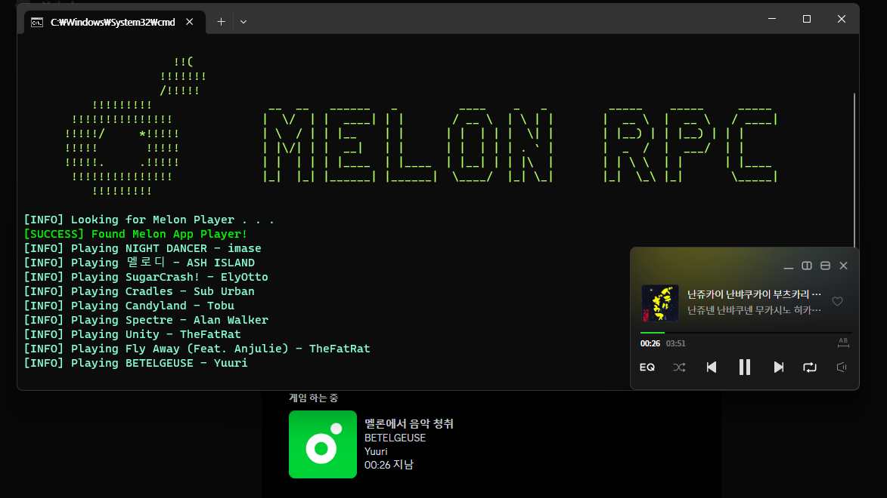

<h1 align="center">
  <br>
  멜론 RPC - 자신이 무엇을 듣는지 뿜내보세요!
</h1>

# 정보
Spotify는 RPC를 지원하지만, 멜론에서는 RPC를 지원하지 않아요..
하지만 이 프로젝트를 사용하면, 멜론에서도 RPC를 사용할 수 있어요!
<br>

# 설치
```
1. Python 3.8+ 버전을 설치해요.
2. pip install discord-rpc pywin32 를 실행해요.
3. python main.py를 통해 멜론 RPC를 실행하면, 끝이에요!
```